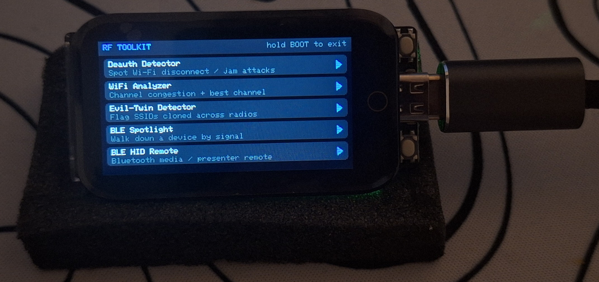

# 📡 Handheld RF Gadget — LILYGO T-Display-S3 Touch

Multi-boot firmware for a pocket-sized passive RF scanner. Three independent
apps share the 16 MB flash; a touch launcher in the factory partition decides
which one boots.

| Slot | Partition | Offset | App | Status |
| :--- | :--- | :--- | :--- | :--- |
| 0 | `factory` | `0x010000` | Touch launcher + Geass idle screen | ✅ built |
| 1 | `ota_0` | `0x210000` | Wi-Fi CSI radar tracker | ✅ built |
| 2 | `ota_1` | `0x610000` | Wi-Fi + BLE proximity sniffer | ✅ built |
| 3 | `ota_2` | `0xA10000` | RF toolkit (5 WiFi/BLE tools) | ✅ built |

The RF toolkit is a *suite*: one flashed binary holding five lightweight tools
behind a sub-menu — deauth detector, Wi-Fi analyzer, evil-twin detector, BLE
signal finder, and a BLE HID media remote. They share the radio and display
code, so packing them into one partition costs far less flash than five
separate images would, and adding `ota_2` (carved from the old SPIFFS region)
left the other three apps and your stored Wi-Fi credentials untouched.

---

## The device

<p align="center">
  <br>
  <em>Idle screen — the Code Geass eye. Tap it to blink; the two side buttons
  switch between this and the menu.</em>
</p>

<table>
  <tr>
    <td align="center"></td>
    <td align="center"></td>
  </tr>
  <tr>
    <td align="center"><b>Main launcher</b> — boots each app from its own flash partition</td>
    <td align="center"><b>RF Toolkit</b> — five passive WiFi/BLE security tools</td>
  </tr>
</table>

Running on a LILYGO T-Display-S3 Touch, powered over USB-C.

---

## Setup

```bash
# PlatformIO Core (the VSCode extension bundles this too)
python3 -m venv ~/.venvs/pio && ~/.venvs/pio/bin/pip install platformio
export PATH="$HOME/.venvs/pio/bin:$PATH"

# Serial access on Arch/CachyOS — the port shows up as /dev/ttyACM0
sudo usermod -aG uucp "$USER"   # log out and back in to take effect
```

## Build & flash

Flash the launcher **first** — it is the factory partition, and it is what the
bootloader falls back to when `otadata` is blank.

```bash
pio run -e menu    -t upload    # launcher   -> 0x010000
pio run -e csi     -t upload    # CSI radar  -> 0x210000
pio run -e scanner -t upload    # WiFi + BLE -> 0x610000
pio run -e toolkit -t upload    # RF toolkit -> 0xA10000
pio device monitor
```

Adding the toolkit to an already-flashed board only needs `menu` (updated
partition table + new launcher entry) and `toolkit`. The `csi` and `scanner`
images keep their offsets, so they do not need re-flashing, and `nvs` is
untouched so stored Wi-Fi credentials survive.

Each `env` flashes only its own slot, so re-flashing the scanner never disturbs
the launcher. `tools/app_offset.py` handles this — watch for its line in the
build log to confirm:

```
app_offset: menu    -> flashing to 0x10000,  otadata reset to factory
app_offset: scanner -> flashing to 0x610000, otadata untouched
```

That script also suppresses the Arduino platform's `boot_app0.bin`, which it
would otherwise write to `0xe000` on *every* upload. That blob is an otadata
image with `ota_seq = 1`, meaning "boot ota_0" — so without this, uploading the
scanner would leave the device booting the CSI slot instead. Flashing the
launcher blanks otadata (erased otadata → bootloader picks `factory`); flashing
an app leaves the boot register alone.

If the board does not enumerate, hold **BOOT**, tap **RESET**, release BOOT to
force the ROM bootloader, then upload.

## Getting back to the launcher

Every app runs both escape hatches from the spec:

- Hold **BOOT (GPIO 0)** for 1.5 s — handled on its own FreeRTOS task, so it
  works even if the app's main loop is wedged.
- Hold anywhere on the **touchscreen** for 3 s — fed from the app's UI loop.

Both reset the boot register to `factory` and reboot.

---

## Notes on the hardware spec

Three things in the concept docs need adjusting against what this board can
actually do:

**Backlight is GPIO 38, not GPIO 15.** The spec's "Hardware Initialization
Rule" calls for pulling GPIO 15 HIGH. That is correct but incomplete: GPIO 15 is
`PIN_POWER_ON`, the peripheral power gate for the LCD, touch controller and
battery divider. The panel *also* needs GPIO 38 (backlight) driven, or you get a
powered, actively-refreshing, completely black screen. `board::begin()` handles
both — GPIO 15 directly, GPIO 38 via LovyanGFX's PWM backlight driver.

**CSI is 2.4 GHz only.** The ESP32-S3 has no 5 GHz radio at all. A dual-band
antenna is fine to use, but the 5 GHz half is dead weight — all sensing happens
in 2.4 GHz, and range/resolution expectations should be set from that band
alone.

**There is no U.FL connector from the factory.** The external-antenna mod on
T-Display-S3 means moving a 0-ohm resistor on the module to switch the RF feed
away from the onboard ceramic antenna. It is a rework, not a plug-in, and it is
irreversible without more rework. Worth deferring until the firmware side is
proven.

---

## How the CSI radar works

Every frame the radio receives carries a per-subcarrier estimate of what the air
did to it in flight. A body moving between transmitter and receiver perturbs
those estimates. Watch them over time and you have a motion sensor that needs
nothing on or near the target.

Two constraints drive the whole design, and neither is obvious from the concept
doc:

**CSI is only meaningful per link.** Every transmitter has its own channel
response, so averaging frames from several APs produces a signal that looks
exactly like motion but is just transmitter-hopping. The app locks onto a single
source MAC and discards everything else. That is what `SEARCHING` means on boot.

**It needs a steady packet rate, and getting one is the hard part.** This turned
out to be the dominant problem in the whole project — see
[Limitations](#limitations) for the measurements. Short version: passive
listening yields single-digit Hz, which is not enough, so the app ships two
active illumination modes. The header shows `locked/total Hz` and turns red
below 5 Hz, because everything downstream is meaningless without it.

**Using it:** pick an illumination source on the channel picker, wait for
warmup, stand out of the path while it auto-calibrates, then move. The score is
a multiple of the calibrated empty-room baseline — 1.0x is a quiet room, and the
graph's guide lines sit at the disturbance and motion thresholds.

### Choosing illumination

The picker offers three, in descending order of how well they work:

| Mode | Rate | Notes |
| :--- | :--- | :--- |
| `JOIN` (active link) | ~100 Hz | Associates to your AP and pings it. Needs `credentials.h`. The only mode that reliably works. |
| `PROBE: ON` | 0 Hz measured | Probe requests to an AP without associating. Transmits fine; the replies carry no CSI. Kept because it costs nothing and may work on APs with 802.11b disabled. |
| `PROBE: OFF` (passive) | 0–7 Hz | Pure listening. Broadcast traffic only. |

The `CSI Hz` column measures each channel live rather than inferring it from AP
count, because the two diverge badly — a channel with the most APs and the
strongest signal can still yield exactly zero.

### Why the radar view shows rings, not blips

The obvious thing to want is a dot on a map. That is not recoverable from this
hardware, for three independent reasons:

**Bandwidth sets range resolution.** A 20 MHz channel gives delay bins 50 ns
apart, and 50 ns of propagation is 15 m of path length. The whole useful sensing
range fits inside one bin. Super-resolution (MUSIC, ESPRIT) might get that to
3–4 m with good SNR — still coarser than the room.

**There is no clock shared with the transmitter.** Real radar knows when it
transmitted. This is passively receiving someone else's beacon, and per-packet
timing jitter plus sampling-frequency offset randomise the absolute delay by
hundreds of nanoseconds. Only changes between packets survive; absolute range
never does.

**The geometry is bistatic.** The measurement is not AP→gadget, it is
AP→person→gadget: the total path. That describes an ellipse with the AP and the
gadget at its foci, and every point on it produces an identical reading. Without
knowing where the AP is, distance from the gadget is one equation in two
unknowns.

So the rings are labelled `NEAR`/`MID`/`FAR` and driven by disturbance
*intensity*, which correlates with proximity to the AP-to-gadget path but also
with how much of the body is moving — a person waving at 5 m outproduces a
person standing still at 1 m. A detection lights the entire ring rather than a
point on it, because a single antenna gives no bearing and a blip at an angle
would be fabricated. The rotating sweep is decoration; the receiver is not
steering anything.

If the bands feel wrong for your room, the next easy improvement is a two-point
calibration (stand near, stand far) to anchor the thresholds to real positions
instead of the current fixed multiples. Actual coordinates need the multi-node
ESP-NOW mesh.

### On `esp-dsp` and SIMD

The spec calls for 128-bit SIMD via `esp-dsp`. I left it out deliberately. The
workload is ~64 subcarriers at roughly 10–50 packets/second — a few thousand
float operations per second, which the S3's FPU handles in microseconds. Adding
a DSP dependency would buy no measurable headroom and complicate the build. If
we later move to a dedicated high-rate transmitter and push into the kHz range,
it becomes worth revisiting.

---

## Limitations

Written down because most of these are not fixable by tuning, and several of
them contradict the concept documents. Anything marked **measured** was observed
on this hardware, not reasoned about.

### 1. Illumination — the binding constraint

This is the one that shapes everything else.

**The ESP32 only produces CSI for frames addressed to us, or broadcast.**
Unicast traffic between other devices is invisible to the CSI engine even in
promiscuous mode. *Measured:* a 2 GB download running on the router's own
channel produced **0 CSI frames** — every frame in it was addressed to the
laptop, not to us.

**DSSS frames carry no CSI at all, and cannot be made to.** CSI *is* the
per-subcarrier channel response; 802.11b spreads a single carrier with no
subcarriers, so there is nothing to measure. This is not a filter that can be
loosened, and DSSS data cannot be "mixed in" with OFDM data. On most 2.4 GHz
routers 802.11b compatibility is on by default, which means beacons go out at
1 Mbit/s DSSS and contribute nothing.

**Everything an unassociated station can elicit is a management frame**, and
management frames go out at the AP's *lowest basic rate* — DSSS, per the above.
Advertising OFDM-only support in our probe requests does not change this,
because the AP selects from its own basic-rate set. *Measured:* 2176 probe
requests transmitted, 0 driver errors, 0 CSI frames returned.

The consequence: **fully passive CSI sensing does not work on a typical home
network.** Observed ambient rates were 0–7 Hz where roughly 50 Hz is wanted.
Active mode (associate + ping) is not a convenience, it is what makes the app
function. The one route back to passive is disabling 802.11b legacy rates on the
router, which forces beacons to OFDM.

### 2. What the radar cannot tell you

**No distance in metres.** Three independent blocks, any one sufficient:
20 MHz of bandwidth puts delay bins 15 m apart in path length; there is no clock
shared with the transmitter, so absolute time-of-flight is unrecoverable; and
the geometry is bistatic (AP→person→gadget), which describes an ellipse of
identical readings rather than a range. The `NEAR`/`MID`/`FAR` rings are
disturbance *intensity*, which is confounded by how much of the body is moving —
a person waving at 5 m outproduces a person standing still at 1 m.

**No bearing.** One antenna, one receive chain. Direction of arrival needs
several spatially separated receivers. A detection therefore lights a whole ring
rather than a point; the rotating sweep is decoration.

**No counting, and no identity.** One aggregate disturbance figure. Two people
are not distinguishable from one moving more.

**A motionless person fades into the background.** The steady-state estimate
keeps adapting, so someone perfectly still is absorbed within roughly 100 frames
and reads as `CLEAR`. This is a motion detector, not a presence detector.
Breathing-rate detection would need a much higher and steadier frame rate.

### 3. Sensing geometry

Range is governed by geometry, not by the noise floor. The target must be near
the line between the illuminating AP and the gadget. Someone crossing that line
6 m out registers strongly; someone walking right past the device but off-path
may not register at all. The concept doc's "3–8 m optimal, capable of
calculating path vectors/direction" is not reachable with this hardware.

### 4. Calibration is positional and perishable

The baseline describes one gadget position, one AP, one channel, one furniture
arrangement. Moving the gadget, switching channels, or the AP changing its rate
invalidates it — which is why changing channel resets everything and
re-calibrates. Calibrating while someone is in the path bakes them into the
baseline and the room reads `CLEAR` with them standing there.

### 5. Hardware ceilings

- **2.4 GHz only.** The ESP32-S3 has no 5 GHz radio. A dual-band antenna's
  5 GHz half is dead weight.
- **No U.FL connector from the factory.** The external-antenna mod means moving
  a 0-ohm resistor on the module — a rework, not a plug-in.
- **One radio front-end, shared.** In the scanner app Wi-Fi and BLE time-slice
  the same 2.4 GHz front end; BLE is held to a ~19% duty cycle so the Wi-Fi
  sweeps get enough uninterrupted dwell to hear a beacon. Both are slower than
  either would be alone.

### 6. Scanner app

**BLE MAC randomisation defeats tracking.** Phones and wearables rotate their
advertised address roughly every 15 minutes, so the same device reappears as a
new entry. The manufacturer ID survives rotation (an iPhone still says "Apple"),
which is why vendor and device-type decoding exist — but correlating a device
across a rotation is not implemented and is a substantially harder problem.

**Apple Continuity decoding is reverse-engineered**, not documented by Apple.
Common message types are reliable; unrecognised ones show as `Apple type NN`
with the raw payload rather than a guess. AirPods model IDs cover the
well-established ones only.

**Distance estimates are bands, not measurements.** RSSI-to-distance assumes a
free-space path loss model; indoors, with walls and bodies in the way, the real
figure is easily off by 2x.

### 7. Active mode trade-offs

It transmits, and it needs your network credentials.

**On-device is the preferred way.** Tap `SET UP >` on the channel picker: it
scans, you pick a network, and you type the password on the touch keyboard. The
password goes from the glass into NVS and is wiped from RAM immediately — it
never exists as a file, a build artifact, or a line of terminal scrollback.

NVS lives in its own flash partition, so credentials survive firmware updates:
`pio run -t upload` rewrites the bootloader, partition table and app and never
touches it. Only `esptool erase_flash` clears them.

Two fallbacks, both less private:

```
pio device monitor
wifi MyNetwork MyPassword     # stored in NVS, connects immediately
wifi-status                   # reports without echoing the password
wifi-clear                    # forget
```

or `credentials.h` (gitignored, compiled into the binary, migrated into NVS on
first boot — delete it afterwards).

Point it at your own access point. What this does *not* compromise is the core
premise: the targets being sensed still need no connection, no app, and no
device on them.

---

## Prior art: RuView

[ruvnet/RuView](https://github.com/ruvnet/RuView) does CSI sensing on the same
chip and independently arrived at the same architecture, which is a useful
check on the decisions here. Its firmware **associates to an AP in station
mode** (`provision.py --ssid --password`) rather than sniffing, and filters CSI
to a single AP MAC "to prevent signal mixing" — the same two conclusions this
project reached the hard way. It documents ~20 Hz per channel, which puts the
0–7 Hz measured here in perspective.

Three things adopted from reading its source:

- **`htltf_en` / `stbc_htltf2_en` on, `channel_filter_en` off.** We had the
  first two off and the last one on — the worst combination. The channel filter
  smooths each subcarrier against its neighbours, which averages away exactly
  the fine structure being measured.
- **NVS credential provisioning** instead of a compiled-in constant.
- **Defensive MAC filtering in the callback**, which this project already did.

One thing deliberately *not* adopted: its `csi_inject_ndp_frame()` sends a null
data packet to the **broadcast** address, and its own comment marks it a
placeholder with no scheduling. A broadcast NDP elicits no reply from anything,
so it cannot generate illumination. The ICMP ping stream here is the working
equivalent.

Worth calibrating expectations against, too: RuView's headline features
(breathing, heart rate, pose, multi-person counting) come from a multi-node mesh
plus a separate ~$140 appliance doing the inference. The ESP32 is the sensor,
not the system.

---

## Layout

```
platformio.ini              build envs, one per app
partitions_multiapp.csv     16 MB multi-boot map
boards/                     custom board definition (16 MB flash, octal PSRAM)
assets/                     source artwork (geass.png) + device photos (images/)
tools/app_offset.py         redirects each env's upload to its own slot
tools/img2rgb565.py         converts an image to an embeddable RGB565 header
src/
  board/                    shared: pinout, LovyanGFX+touch driver, app switching
  menu/                     App 0 — launcher
    main                    app list + boot-partition switching
    face                    Geass idle screen (blits the embedded image)
    geass_image.h           generated RGB565 artwork (see tools/img2rgb565.py)
  csi/                      App 1 — CSI radar
    csi_capture             radio setup, CSI callback, turbulence metric
    channel_survey          measures CSI yield per channel, not just AP count
    illuminator             probe-request illumination (unassociated)
    active_link             associate + ping illumination (needs credentials.h)
  scanner/                  App 2 — WiFi + BLE sniffer
  toolkit/                  App 3 — RF toolkit suite
    tool                    shared Tool interface + UI helpers
    deauth                  deauth/disassoc flood detector
    analyzer                channel congestion + best-channel pick
    eviltwin                duplicate/mismatched-SSID detector
    spotlight               BLE hot/cold signal finder
    blehid                  BLE media/presenter remote (HID peripheral)
```

`build_src_filter` in each env compiles `src/board/` plus exactly one app
directory, so the apps stay fully independent binaries.

## Status

All three apps compile clean (PlatformIO Core 6.1.19, espressif32 6.11.0,
Arduino core 2.0.17) and the upload offsets are verified:

| Env | Flash used | Slot size | Upload offset |
| :--- | ---: | ---: | :--- |
| `menu` | 367 KB | 2 MB | `0x010000` ✅ |
| `csi` | 815 KB | 4 MB | `0x210000` ✅ |
| `scanner` | 979 KB | 4 MB | `0x610000` ✅ |
| `toolkit` | 1011 KB | 4 MB | `0xA10000` ✅ |

**Run on hardware.** Display, touch, app switching and the Wi-Fi/BLE scanner are
confirmed working. The CSI radar's capture path and UI are confirmed; its
detection thresholds (`1.35`/`1.8`/`3.2` × baseline) are still first guesses and
want tuning against real numbers. Active mode is built and compiles both with
and without `credentials.h`, but has not yet been run against a live AP.

If `pip install platformio` gives you a `ModuleNotFoundError: No module named
'intelhex'` during the bootloader step, `pip install intelhex` into the same
venv — bundled esptool misses that dependency.
